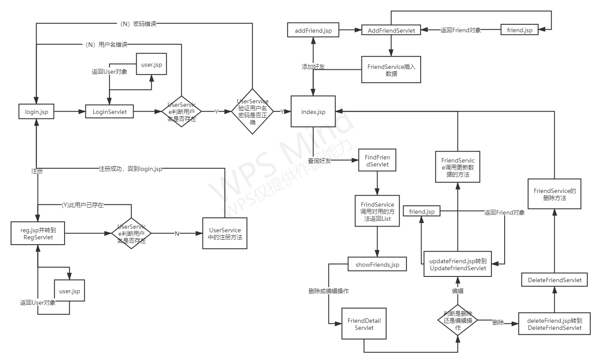

## FriendApp

上图为整个项目的代码结构。

### com.connect

这个包里含有一个类DbTool，定义了6个方法，分别为获取连接对象，返回的是Connection；关闭结果集对象；关闭预编译对象；关闭连接对象；后面两个主要是整合前面的关闭方法，当进行更新操作时（插入数据、修改数据、删除数据）此时只用到两个对象，因此只要关闭两个资源；最后一个是查询操作，需要用到3个对象，因此需要关闭三个资源。

### com.filter

这个包里只定义了一个过滤器，主要是阻止用户未登录就进行其他操作。

原理：过滤器，在每次响应前都要经过过滤器的判断，主要有，判断是不是由login.jsp、erroe.jsp、LoginServlet、reg.jsp、RegServlet进入过滤器或者已经登录，可以获取用户名，则允许进行其他操作，否则转到登录页面。

### com.module和com.service

com.moudle包里由6个方法，分为两类，分别是对User、Friend的操作，使用到JavaBean，对两个对象进行封装，定义接口，然后再定义一个去是实现接口。

com.service包里有两个类，FriendService和UserService

##### User

元素类型与数据库字段一致，然后使用set和get去设置与获取元素值。

它的接口中有四个方法，分别为：

##### Friend

于User类似，其中有7个方法

#### UserService

这个类里主要有三个方法：

- 验证用户是否存在：此时会调用按用户查询的方法，判断返回值是否为空，返回一个boolean类型的值
- 用户登录服务：调用使用用户名和密码查找的方法，判断返回值是否为空，此方法返回的也是一个boolean类型的值
- 用户注册服务：这部分调用的插入数据的方法，无返回值

#### FriendService

此中有4个方法

- 添加好友信息：调用其插入的方法，返回一个int值，为插入操作中数据库被修改的行数。
- 按条件查询好友：他主要分为3部分
  - 查询所有：仅以username作为查询条件，返回为一个List。
  - 以好友的名字进行精确查找：会传入输入的名字以及username，返回也是一个List
  - 好友名字模糊查抄：sql语句会使用到like，返回值也是一个List
- 更新用户信息：调用更新数据的方法，update，返回一个int，即被更改的行数。
- 删除用户信息：调用删除数据的方法，delete，返回一个int，即被更改的行数。

### com.servlet

#### RegServlet

处理注册，使用一个jsp的调用JavaBean的方法得到一个User对象。

首先去判断用户名是否存在，不存在则提示“注册成功”，转到login.jsp；存在则提示此“用户已存在”，回到reg.jsp。

#### LoginServlet

处理登录，使用一个jsp的调用JavaBean的方法得到一个User对象。

首先去判断用户名是否存在，不存在则提示“用户名不存在”，回到login.jsp；存在则继续用用户名和密码判断此用户是否存在，不存在则提示密码错误，存在则用HttpSeession存储username，并转入index.jsp。

#### AddFriendservlet

处理添加Friend信息，转入friend.jsp，通过JavaBean的方法获取Friend对象，调用FriendService中添加的方法。

#### FindFriendServlet

接收用户输入的值，判断其选择，调用FriendService中的方法，获取关于User的List数组，转到showFriends.jsp页面对查询的内容进行显示。

==未处理数据库中没有这一类数据的情况==

#### FriendDetailServlet

这部部分主要用于用户的Friend信息的操作是删除还是更新，并且同fid从实现的方法中获取Friend对象，以进行下一步的删除或更新操作，删除则转到deleteFriend.jsp，更新则转到updateFriend.jsp.

#### DeleteFriendServlet

接收传入的fid，通过条件fid进行删除操作

#### UpdateFriendServlet

首先通过friend.jsp获取表单得到Friend对象，然后去更新数据。

#### jsp页面

- user.jsp：通过Bean去获取一个User对象
- login.jsp：用户输入两个值username、userpass，进入LoginServlet.
- reg.jsp：用户输入两个值username、userpass，进入RegServlet.
- index.jsp：登陆成功后进入的页面，可进行两个操作，添加好友信息，跳转到addFriend.jsp；查询好友，进入FindFriendServlet
- error.jsp：过滤器判断未登录会进入此页面，然后跳转到login.jsp
- friend.jsp：通过Bean去获取一个Friend对象
- addFriend.jsp：填写Friend对象元素的值，转到AddFriendServlet
- showFriend.jsp：表格显示查询到的用户信息，此部分是一个新的页面，会有删除和更新操作，都会先到FriendDetailServlet
- deleteFriend.jsp：先显示要删除的用户的信息，然后提交表单，进入DeleFriendServlet
- updateFriend.jsp：显示更改的Friend的值，直接进行更改，提交表达到达AddFriendSevlet

# ==未解决的问题：中文存储到数据库中为乱码==

